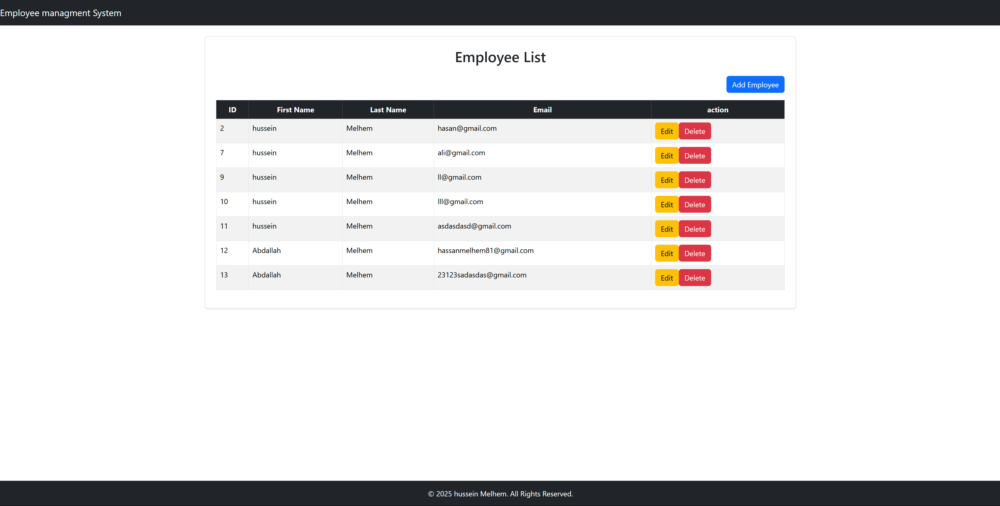
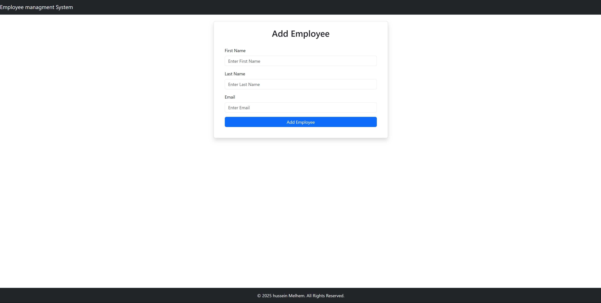

# Employee Management System (EMS)

This is a full-stack **Employee Management System (EMS)** developed using **Spring Boot** for the backend API and **React** for the frontend. It allows you to manage employee data, including adding, editing, and deleting employees.

## Features

- **Employee Management**: Add, edit, and list employees.
- **CRUD Operations**: Implemented using Spring Boot (REST APIs) and React (UI).
- **Responsive UI**: Built with React, using Bootstrap for styling.
- **Validation**: Form validation for employee creation and editing.

## Technologies Used

- **Backend**:
  - Java
  - Spring Boot
  - Spring Data JPA
  - MySQL (or H2 for local development)
  - RESTful APIs

- **Frontend**:
  - React.js
  - Bootstrap (for UI components)
  - React Router (for navigation)

- **Others**:
  - Axios (for making HTTP requests)

## Screenshots

### Dashboard (Employee List)

  
This is the dashboard where all employees are listed, with options to edit or delete them.

### Add Employee Form

  
This is the form to add a new employee with validation.

### Edit Employee Form

  
This is the form used to edit an existing employee.

## Project Setup

### Backend (Spring Boot)

1. **Clone the repository**:
   ```bash
   git clone https://github.com/your-username/ems-system.git
   cd ems-system/backend
   ```

2. **Configure application properties**:
   - Make sure to configure the database connection in `src/main/resources/application.properties` or `application.yml`.

   Example:
   ```properties
   spring.datasource.url=jdbc:mysql://localhost:3306/ems_db
   spring.datasource.username=root
   spring.datasource.password=root
   spring.jpa.hibernate.ddl-auto=update
   spring.datasource.driver-class-name=com.mysql.cj.jdbc.Driver
   ```

3. **Build and run the backend**:
   - If using **Maven**:
     ```bash
     mvn clean install
     mvn spring-boot:run
     ```
   - If using **Gradle**:
     ```bash
     gradle build
     gradle bootRun
     ```

4. The backend will run on **http://localhost:8080**.

### Frontend (React)

1. **Navigate to the frontend directory**:
   ```bash
   cd ems-system/frontend
   ```

2. **Install dependencies**:
   ```bash
   npm install
   ```

3. **Run the frontend**:
   ```bash
   npm start
   ```

4. The frontend will run on **http://localhost:3000**.

---

## API Endpoints (Backend)

### Employee API

1. **Get All Employees**  
   - `GET /api/employees`
   - Returns a list of all employees.

2. **Create Employee**  
   - `POST /api/employees`
   - Request body:
     ```json
     {
       "firstName": "John",
       "lastName": "Doe",
       "email": "john.doe@example.com"
     }
     ```
   - Response: Created employee object.

3. **Update Employee**  
   - `PUT /api/employees/{id}`
   - Request body:
     ```json
     {
       "firstName": "John",
       "lastName": "Doe",
       "email": "john.doe@example.com"
     }
     ```
   - Response: Updated employee object.

4. **Delete Employee**  
   - `DELETE /api/employees/{id}`
   - Response: Success message.

---

## Folder Structure

```
ems-system/
│
├── backend/           # Spring Boot backend
│   ├── src/
│   ├── pom.xml        # Maven config (or build.gradle for Gradle)
│   └── application.properties
│
└── frontend/          # React frontend
    ├── public/
    ├── src/
    ├── package.json   # React project configuration
    └── .gitignore
```

---

## Additional Notes

- **Database Setup**: Ensure your database (e.g., MySQL) is up and running before starting the backend.
- **CORS**: If you're running the frontend and backend on different ports, you might need to configure CORS in Spring Boot:
  ```java
  @CrossOrigin(origins = "http://localhost:3000")
  @RestController
  @RequestMapping("/api/employees")
  public class EmployeeController { ... }
  ```

---

## Future Enhancements

- Add user authentication (JWT, Spring Security).
- Improve error handling and user experience on the frontend.
- Deploy the application to a cloud platform (AWS, Azure, Heroku).

---

## License

This project is licensed under the MIT License - see the [LICENSE](LICENSE) file for details.
